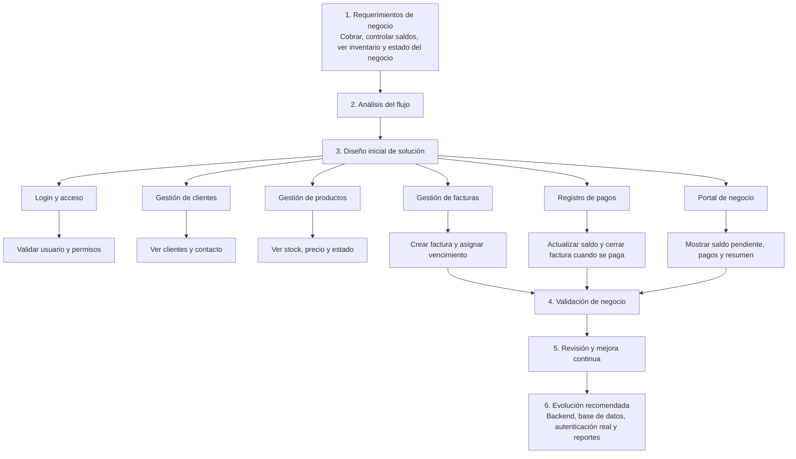

# cxc-gimnasios

Proyecto de cuentas por cobrar / inventario.

## Estructura actual

- `index.html` — estructura de la aplicación y modales
- `css/styles.css` — estilos de la aplicación
- `js/app.js` — punto de entrada
- `js/ui.js` — coordinación de vistas, eventos y renderizado
- `js/state.js` — estado y persistencia local
- `js/domain.js` — reglas de moneda, ganancia, vida útil y series
- `js/invoice-form.js` — formulario de factura con varias líneas
- `server/` — servidor local Express

## Ejecutar localmente

1. Abrir terminal en `server/`
2. Ejecutar `npm install`
3. Ejecutar `npm start`
4. Abrir `http://localhost:3000`

## Diagrama de procesos actuales

Este diagrama resume el flujo actual de la aplicación en un lenguaje simple para explicárselo a Cristian, alineado con buenas prácticas de ingeniería de software: requisitos, análisis, diseño, implementación, validación y evolución.

### Estructura inicial recomendada

- Requisitos claros: objetivo de negocio, actores (Cristian, negocio cliente, administrador).
- Diseño de módulos: autenticación, clientes, productos, facturas, pagos y portal.
- Implementación ordenada: separar lógica de negocio, interfaz y almacenamiento.
- Validación básica: comprobar login, creación de facturas, pagos y visualización de saldos.
- Evolución: pasar de almacenamiento local a una base de datos y backend cuando el sistema crezca.

### Buenas prácticas para este proyecto

- Mantener los procesos documentados.
- Separar responsabilidades entre UI, lógica y datos.
- Usar flujos simples y consistentes para el usuario.
- Validar cada cambio antes de entregarlo.
- Preparar la app para crecer sin perder claridad.

## Notas

- `server/index.js` sirve la raíz del proyecto como frontend estático.
- Los datos actuales se guardan en `localStorage` del navegador bajo `fierro_data_v1`.
- Si usas un live server directo en la raíz, la URL correcta es `http://localhost:3000/`.
- El siguiente paso de arquitectura será separar las áreas restantes de `ui.js` y después migrar el estado a una API y base de datos real.
